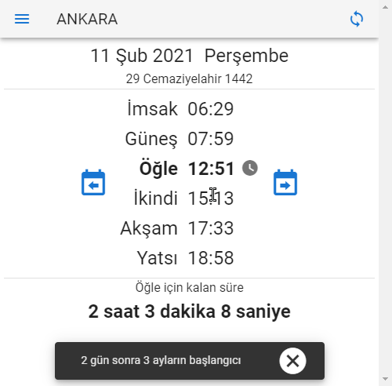

# namaz-vakti [(English)](README.md) 
Ücretsiz, reklamsız, açık kaynaklı ve şık namaz vakti uygulaması. [Google Play Store](https://play.google.com/store/apps/details?id=io.kevn.namaz_vakti), [Windows Apps Store](https://www.microsoft.com/en-us/p/namaz-vakti/9p6rv2n2mrbv), ve [webde](https://canbax.github.io/namaz-vakti/) kullanılabilir.

  

İnternet üzerinden [Diyanet İşleri Başkanlığı'nın resmi web sitesinden](https://namazvakitleri.diyanet.gov.tr/en-US) vakit bilgilerini alır. Verileri almak için [namaz-vakti-api](https://github.com/canbax/namaz-vakti-api) kullanılır. Şu anda [namaz-vakti-api](https://github.com/canbax/namaz-vakti-api) ücretsiz bir Heroku sunucusunda çalışmaktadır. Ücretsiz sunucu 1 saatlik hareketsizlikten sonra uykuya daldığı için ilk yükleme yavaş olabilir. [namaz-vakti-api](https://github.com/canbax/namaz-vakti-api) de açık kaynaklı bir projedir.

## Özellikleri
### PWA
namaz-vakti bir [Progressive Web App (PWA)](https://developer.mozilla.org/en-US/docs/Web/Progressive_web_apps) 'dir. Bu, bir web sitesi olmasına rağmen, İnternet üzerinden yüklendikten sonra İnternet olmadan çalışabileceği anlamına gelir. namaz-vakti verileri **ayda bir alır**. Yani verileri aldıktan sonra, bir ay boyunca İnternet bağlantısı olmadan kullanabilirsiniz.

### Hicri Takvim
_"Dini Günler"_ menü öğesinden dini günleri ve geceleri görebilirsiniz.

_"Namaz Vakitleri"_ ekranında, dini bir gün yaklaştığında bir uyarı göreceksiniz.

  

Hicri takvim hesaplamaları herhangi bir üçüncü taraf uygulama kullanılmadan yapılır. Kaynak kodları [HijriDate.ts dosyasının](https://github.com/canbax/namaz-vakti/blob/master/src/HijriDate.ts) içindedir 

### Çeşitli Özelleştirmeler
- Birden çok tema (_Dark_ veya _Light_)
- Dili değiştir (şu anda İngilizce ve Türkçe)
- Hicri tarihi göster veya gizle
- Yakınlaştırma düzeyini değiştir
- Birden çok tarih biçimi
- Birden çok zaman biçimi

[Typescript](https://www.typescriptlang.org/), [Vue.js](https://vuejs.org/) ve [Vuetify](https://vuetifyjs.com/en/) ile oluşturulmuştur.
