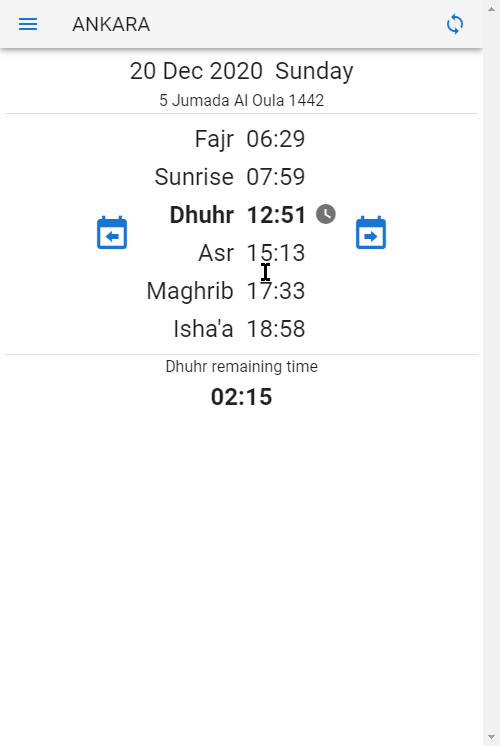
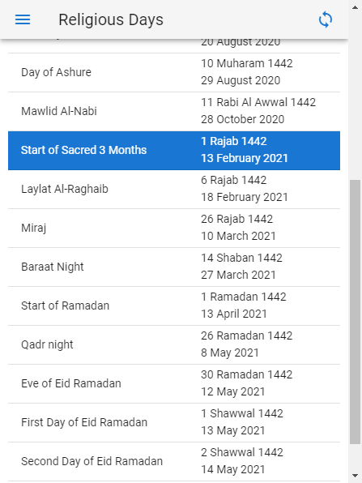
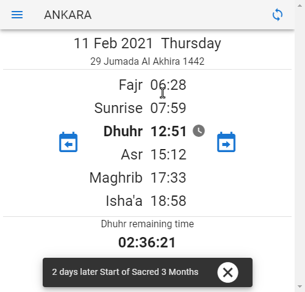
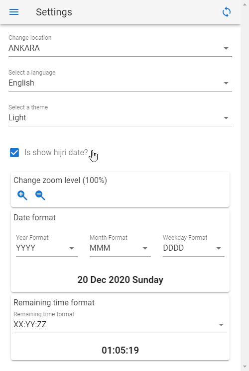

Proje https://github.com/canbax/namaz-vakti alıntıdır. Sitenin kaynak kodlarını kendi projeme uyarlamak üzere kopyaladım.
# namaz-vakti [(Türkçe)](BENİOKU.md) 
Free, ad-free, open-source, and sleek Muslim Praying Times app. Available on [Google Play Store](https://play.google.com/store/apps/details?id=io.kevn.namaz_vakti), [Windows Apps Store](https://www.microsoft.com/en-us/p/namaz-vakti/9p6rv2n2mrbv), and [the web](https://canbax.github.io/namaz-vakti/).

  

Pulls time information from [the official website of the turkish directorate of religious affairs](https://namazvakitleri.diyanet.gov.tr/en-US) over the internet. To fetch data, [namaz-vakti-api](https://github.com/canbax/namaz-vakti-api) is used. Currently [namaz-vakti-api](https://github.com/canbax/namaz-vakti-api) runs on a free Heroku server. So there might be a cold start since it goes to sleep after 1 hour of inactivity. [namaz-vakti-api](https://github.com/canbax/namaz-vakti-api) is also an open-source project.

## Features
### PWA
namaz-vakti is a [Progressive Web App (PWA)](https://developer.mozilla.org/en-US/docs/Web/Progressive_web_apps). So it means although it is a website, once it's loaded over the Internet, it can work without the Internet. namaz-vakti fetches data **monthly**. So once you get data, you can use it for a month without an Internet connection.

### Hijri Calender
You can see religious days and nights from the menu item _"Religious Days"_.

  

In the _"Praying Times"_ screen, when a religious day is close, you will see an alert.

  

Hijri calendar calculations are without using any third-party application. The logic is inside [HijriDate.ts file](https://github.com/canbax/namaz-vakti/blob/master/src/HijriDate.ts)

### Various Customizations
- Multiple themes (_Dark_ or _Light_)
- Change language (currently English and Turkish)
- Show or hide hijri date
- Change zoom level
- Multiple date formats
- Multiple time formats

  

Built with [Typescript](https://www.typescriptlang.org), [Vue.js](https://vuejs.org), and [Vuetify](https://vuetifyjs.com/en).
